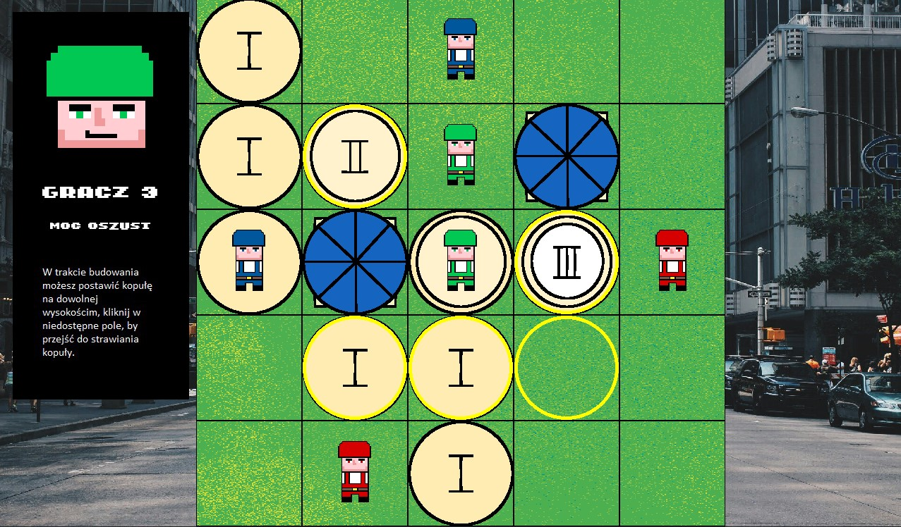

# Gra-planszowa-Budowniczowie
Projekt na przedmiot Podstawy Języków Funkcyjnych

Implementacja gry planszowej BUDOWNICZOWIE zainspirowanej logiczną grą planszową Santorini.
Rozgrywka przeznaczona dla 2-3 osób.

PRZYGOTOWANIE DO GRY:

1. W menu należy wybrać liczbę graczy biorących udział w rozgrywce (opcją podstawową jest 2 graczy).
2. Każdy z graczy wybiera jedną z dostępnyc mocy (opcją podstawową jest brak mocy specjalnych).
3. Każdy z graczy ustawia po 2 pionki na planszy
 

ROZGRYWKA

Gracze wykonują naprzemiennie swoje tury, każda tura składa się z:

1. fazy ruchu - gracz musi ruszyć jednym ze swoich pionków na sąsiednie pole, musi ono być niezajęte, a jego wysokość może być maksymalnie o 1 wyższa od wysokości pola, na którym jest pionek (4 piętro - dach - również jest niedostępne dla pionków).
 
2. fazy budowania - gracz stawia na sąsiednim niezajętym polu blok budowli, przy czym nie można przekorczyć 4 pięter, parter liczy się jako pierwsze piętro.
 

Gra toczy się dopóki, któryś z graczy nie wejdzie w fazie ruchu na 3 piętro, lub inny gracze nie odpadną z gry. Odpaść można, jeśli w skutek działań przeciwnika lub własnych błędów:

1. Żaden z pionków gracza nie może wykonać ruchu w jego turze.
2. Ruszony pionek nie może wybudować budowli.
 

MOCE SPECJALNE

W grze występuje 6 mocy specjalnych, modyfikujących rozgrywkę. Są to:

1. DWUSKOK: Gracz może wykonać dwa ruchy (drugi ruch opcjonalny), jednak nie może wrócić na pole, z którego startował.
2. WOJOWNIK: Gracz może wykonać ruch na pole zajęte przez przeciwnika, pionki zamieniają się wtedy miejscami.
3. OSZUST: Gracz może w fazie budowania postawić kopułę na dowolnej wysokości.
4. DEWELOPER: Gracz możę w fazie budowania postawić dwa bloki, jednak nie mogą być one na tym samym polu.
5. WYSOKOŚCIOWIEC: Gracz może postawić dwa bloki na tym samym polu, chyba że drugi blok byłby kopułą.
6. SPYCHACZ: Gracz może wejść na pole zajęte przez przeciwnika, przepychając go zgodnie z kierunkiem ruchu. Ruch możliwy do wykonania jedynie jeśli kolejne pole za przeciwnikiem jest niezajęte i nie ma na nim kopuły.
7. POŚPIESZNY: Jeśli twój pionek nie zmienia wysokości może przesunąć się o dowolną liczbę pól w wybranym kierunku.
8. SKOCZEK: Zyskujesz możliwość wygrania poprzez przemieszczenie się o minimum dwa pola w dół.
